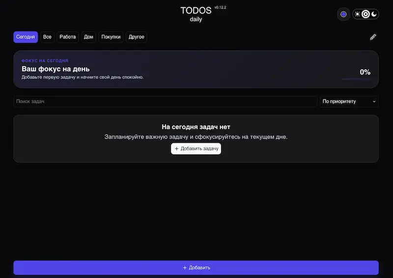

# TODOS daily

[English version](README.en.md)

> Приватный offline-first список задач для ежедневного использования.

[](https://danilchugaev.github.io/todos-daily/)



## О проекте

TODOS daily — прогрессивное веб-приложение для управления личными задачами. Оно работает без сервера: данные сохраняются в браузере через IndexedDB и не передаются третьим лицам. Приложение можно установить на устройство как PWA и использовать после первой загрузки без подключения к интернету.

## Возможности

- создание, редактирование, завершение и удаление задач;
- категории с изменением названий и порядка;
- приоритеты задач: высокий, средний, низкий или без приоритета;
- подзадачи для декомпозиции работы;
- фильтрация по категории;
- светлая, тёмная и системная темы;
- предупреждение о потере несохранённых изменений;
- локальное хранение данных в IndexedDB и запрос persistent storage;
- установка как Progressive Web App.

## Стек

- **React 19** и **TypeScript**;
- **Vite**;
- **Dexie** и **IndexedDB**;
- **PostCSS**;
- **vite-plugin-pwa**;
- **ESLint** и строгая проверка TypeScript.

## Архитектура

- `src/components` — UI-компоненты и модальные окна;
- `src/hooks` — реактивная работа с задачами и категориями;
- `src/utils/db` — схема Dexie и миграции IndexedDB;
- `src/styles` — глобальные стили, дизайн-токены и темы;
- `public` — PWA-иконки и изображение проекта.

Данные остаются на устройстве пользователя. Очистка данных браузера или хранилища сайта удалит локальные задачи.

## Запуск локально

```bash
git clone git@github.com:DanilChugaev/todos-daily.git
cd todos-daily
yarn install
yarn dev
```

Для локальной разработки приложение откроется по адресу `http://localhost:5173/todos-daily/`.

## Проверки и production-сборка

```bash
yarn lint
yarn ts:check
yarn build
yarn preview
```

## Деплой

Проект автоматически публикуется в GitHub Pages при push в ветку `master`. Конфигурация находится в [`.github/workflows/deploy.yml`](.github/workflows/deploy.yml).

## Лицензия

Проект распространяется по лицензии [MIT](LICENSE).
